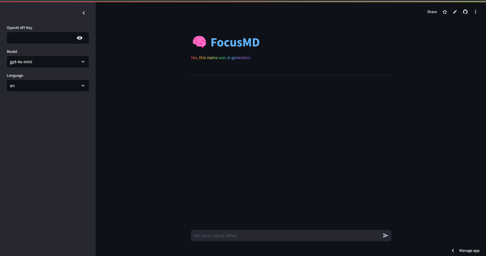

:warning: Everything between << >> needs to be replaced (remove << >> after replacing)

#  ADHD Assistant 
## CS110 Final Project   Fall, 2024

## Notes:
- edit based on text below, this repository's main file will run based on this command:py -m streamlit run "c:/Users/micha/OneDrive/Desktop/CS 110/final-project-mike-r-s-team/template_final_project-master/main.py"
- However I understand that this shoudln't be an issue for the grader like it was for me
 - I uploaded the website to streamlit.io as the url: https://cs110-finalproject-by-michaelrullo.streamlit.app/
 - This was uploaded and can be altered via my github repository found here: https://github.com/Michael-Rullo/portfolio_projects/tree/main/adhd_chatbot
 - Due to installation errors (2 python installations not on PATH) it was difficult to test the code in this repo
 - If this code is nonfunctioning for any reason (it shouldn't be, this and the other repo are identical with just a few changes for uploading online)
 - Please feel free to use the website provided and the repo provided
 - However, I am confident that this code is functioning, I was just unable to test it (tested the other repo and would copy code over)

## Team Members

 Michael Rullo 

***

## Project Description

 ADHD assistant, based on openai api, that I train through a jsonl file and am able to chat with

***    

## GUI Design

### Initial Design
- Switched project so initial design was deleted

### Final Design

## Program Design

### Features

1.  user friendly and asthetically pleasing interface
2.  changable models
3.  chat history 
4.  trained model
5.  accurate chat

### Classes

- Controller
    - controls the Api class and handles the graphical processes
- Api
    - Takes user input and returns the ai assistants message

## ATP
1. Menu Navigation
    - Verify that the program is easily navigated
| Step                 |Procedure             |Expected Results                   |
|----------------------|:--------------------:|----------------------------------:|
|  1                   | run the gui/website  | website/gui opens                 |
|  2                   | click on the api box | api key box opens for input       |
|  3                   | select a language    | language drop down for selection  |
|  4                   | select a model       | model drop down for selection     |

2. Error Handling
    - Verify that the program handles incorrect apis (the only possible error to the best of my knowledge)
| Step                 |Procedure             |Expected Results                   |
|----------------------|:--------------------:|----------------------------------:|
|  1                   | run the gui/website  | website/gui opens                 |
|  2                   | click on the api box | api key box opens for input       |
|  3                   | enter any string     | api key box recieves the string   |
|  4                   | veify outcome        | error message in main terminal    |
|                      |                      | can be fixed immediately(no crash)|

3. Model Changing
    - Verify that the api model can be switched
| Step                 |Procedure                 |Expected Results                   |
|----------------------|:--------------------:    |----------------------------------:|
|  1                   | run the gui/website      | website/gui opens                 |
|  2                   | click on the api box     | api key box opens for input       |
|  3                   | enter a valid api key    | api key works; no error           |
|  4                   | ask the api for its model| assistant tells its running model |
|  5                   | switch the model         | model switches                    |
|  6                   | ask the api for its model| assistant tells diff running model|

4. Language Changing
    - Verify that the api language can be changed
| Step                 |Procedure                 |Expected Results                   |
|----------------------|:--------------------:    |----------------------------------:|
|  1                   | run the gui/website      | website/gui opens                 |
|  2                   | click on the api box     | api key box opens for input       |
|  3                   | enter a valid api key    | api key works; no error           |
|  4                   | message the api          | assistant responds in english     |
|  5                   | open the language box    | language box opens                |
|  6                   | select a different lang  | language selection changes        |
|  7                   | message the api          | assistant responds in diff lang   |

5. Model Responds
    - Verify that the api model responds accurately
| Step                 |Procedure                 |Expected Results                   |
|----------------------|:--------------------:    |----------------------------------:|
|  1                   | run the gui/website      | website/gui opens                 |
|  2                   | click on the api box     | api key box opens for input       |
|  3                   | enter a valid api key    | api key works; no error           |
|  4                   | message the api          | assistant responds to inquiry     |

## External Modules
- openai
- streamlit